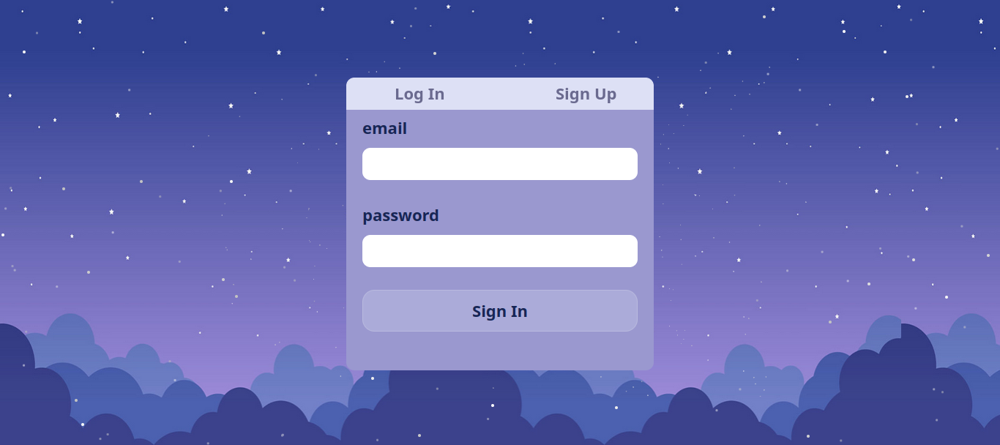

# Full Stack Application

This project is a full-stack application that consists of a Flask backend API and a React TypeScript frontend. It fulfills the requirements mentioned in the "Full Stack Assignment.pdf" document. The backend API is built using Flask and utilizes SQLite as the database with SQLAlchemy as the ORM library. The frontend is developed using React with TypeScript and styled using Tailwind CSS.

## Backend Installation

1. Clone the repository from GitHub:

```shell
git clone https://github.com/salmaayad0/marketers-flask-react-task.git
```

2. Change to the project directory:

```shell
cd marketers-flask-react-task
```

3. Install the backend dependencies using pip (preferably in a virtual environment):

```shell
pip install -r requirements.txt
```

## Backend Configuration

1. Open the `app.py` file in the backend directory.
2. Set the necessary configuration variables, such as database connection details.

## Backend Usage

1. Run the following command to create the SQLite database:

```shell
python models.py
```

2. Migrate database using Flask-Migrate:

```shell
flask db init
flask db migrate -m "Initial migration."
flask db upgrade
```
3. Start the backend server:

```shell
python app.py
```

4. Access the API endpoints through the following routes:

- View all users: [http://127.0.0.1:5000/](http://127.0.0.1:5000/)
- Login: [http://127.0.0.1:5000/login](http://127.0.0.1:5000/login)
- Signup new user: [http://127.0.0.1:5000/signup](http://127.0.0.1:5000/signup)
- Logout: [http://127.0.0.1:5000/logout](http://127.0.0.1:5000/logout)
- View all projects: [http://127.0.0.1:5000/projects](http://127.0.0.1:5000/projects)

## Backend Folder Structure

```plaintext
├── backend
│   ├── app.py
│   ├── __init__.py
│   ├── controllers.py
│   ├── models.py
│   ├── requirements.txt
│   └── ...
```

- The `app.py` file contains the Flask application setup and routes.
- The `controllers.py` file contains the route handlers and business logic.
- The `models.py` file defines the database models using SQLAlchemy.
- The `requirements.txt` file lists the required Python packages.

## Frontend Installation

1. Change to the frontend directory:

```shell
cd frontend
```

2. Install the frontend dependencies using npm:

```shell
npm install
```

## Frontend Usage

1. Start the frontend development server:

```shell
npm start
```

2. Access the application in your browser at [http://localhost:3000](http://localhost:3000).

## Frontend Folder Structure

```plaintext
├── frontend
│   ├── public
│   │   ├── index.html
│   │   └── media
│   ├── src
│   │   ├── components
│   │   ├── features
│   │   ├── test
│   │   ├── styles
│   │   ├── App.tsx
│   │   └── index.tsx
│   ├── package.json
│   ├── tsconfig.json
│   └── tailwind.config.js
```

- The `src/components` directory contains reusable components.
- The `src/features` directory contains the different pages of the application.
- The `src/styles` directory contains the CSS stylesheets and/or Tailwind CSS classes.
- The `App.tsx` file is the entry point of the React application.
- The `index.tsx` file is the render file the React application.
- The `package.json` file lists the frontend dependencies and scripts.
- The `tsconfig.json` file contains the TypeScript configuration.
- The `tailwind.config.js` file is the configuration file to tailwindcss framework.

## Additional Notes

- The backend uses Flask-Login for authentication and Werkzeug.security to encrypt passwords.
- The frontend uses React Router DOM for managing routes and FontAwesome for emoji icons.
- The backend and frontend components are organized based on the MVC (Model-View-Controller) pattern.
- The project structure and file organization can be modified as per your convenience.
- Remember to secure sensitive information such as secret keys and API tokens.
- Consider enhancing the authentication process, adding unit tests, and using a production-ready DBMS like PostgreSQL for a production environment.

## UI Images

You can find the UI images in the [UI_Images].